# RataTutor


A study assistant that turns your notes and documents into flashcards, summary notes and quizzes, with a chat tutor attached to each study material. It started as a five-person university web engineering project, and I kept maintaining it afterwards.


The hosted copy is offline: the free-tier host suspended its services in October 2026, so the links that used to be here led to empty pages and were removed. Everything runs locally from the steps below. The AI features call OpenRouter with the model named in `OPENROUTER_MODEL` (see below), so they only work while that model id is still listed there.

## Stack

- **Backend:** Django, Django REST Framework, SimpleJWT, django-cors-headers, SQLite in development, Cloudinary for uploaded files in production
- **Frontend:** React, Vite, Tailwind CSS
- **AI:** the OpenAI Python SDK pointed at OpenRouter
- **Document parsing:** pypdf, python-docx, python-pptx
- **Run and deploy:** one npm command for local development, one Docker image serving both the API and the built front end on Render

## What it does

- Upload PDF, DOCX, PPTX or TXT files to a study material and extract their text.
- Generate flashcard sets (1 to 20 cards), multiple-choice quizzes (1 to 20 questions) and summary notes from a material's text. The model's JSON reply is parsed and validated before anything is saved, with a fallback title when the model's title is unusable.
- Chat with an AI tutor that belongs to one material and keeps its history.
- Organise materials: pin, trash and restore, permanent delete, public or private, and copy a public material from another user.
- Keep a study streak: the backend records one active day per day (a login counts), tracks the current and longest streak, and reports when a streak is at risk.

## How the chat keeps its context

Each conversation stores its messages, a rolling summary and a count of messages since the last summary.

- A conversation of six messages or fewer sends every message to the model.
- A longer one sends the stored summary plus the last four messages.
- The summary is regenerated by a second model call. The trigger is a message count between 5 and 8, chosen by how many "explain / why / how" style words appear in the last five messages.
- The material's text is included only when the prompt contains a trigger word such as "document", "material" or "according to". A material under 2,000 characters is sent whole. A longer one is cut into 1,000-character chunks and the first three are sent. They are not ranked by relevance, and the code carries a TODO for that.

## Model setting

All AI calls read one model id from `OPENROUTER_MODEL` in `backend/.env`, defaulting to `google/gemma-4-31b-it:free`. This used to be a literal `google/gemini-2.0-flash-exp:free` repeated in eight calls in `backend/api/services/ai_service.py`. OpenRouter removed that model from its catalogue and every AI call failed, so the id is now a setting. When a model is retired, pick a current id from `https://openrouter.ai/api/v1/models` and change the environment variable, with no code change.

## API

There are 42 REST routes under `/api/` and `/auth/`, built from DRF viewsets and a few function-style views.

- **`/auth/`** (10 routes): register, logout, token, token refresh, password reset and confirm, profile read and update, record activity, streak status.
- **Materials:** list and create, pinned, trash and public lists, detail (get, patch, put, delete), toggle pin, toggle visibility, permanent delete, copy, upload an attachment, get or create the material's conversation.
- **Generation:** `POST /api/materials/{id}/generate-flashcards/`, `generate-quiz/`, `generate-notes/`.
- **Conversations:** list, create, retrieve, chat, regenerate summary, delete.
- **Content:** viewsets for notes, flashcard sets, flashcards, quizzes, quiz questions and attachments.

The full list is in `backend/api/urls.py` and `backend/accounts/urls.py`.

## Tests

There are no automated tests yet. `backend/api/tests.py` and `backend/accounts/tests.py` are the empty files Django generates.

## My part

From `git log`, 127 of the 256 commits in this repository are mine (the rest are teammates and 18 Dependabot commits). The work I can point to in the history:

- The initial Django, React, Vite and Tailwind integration, the Dockerfile and entrypoint, and the Render deployment, including the catch-all redirect that serves the React app from Django.
- Backend validation and serializers, password reset by email, Cloudinary storage and the split between development and production storage.
- The streak logic, moved fully to the backend, with logins counting as activity.
- The AI service: the switch from the Google Gemini SDK to the OpenAI SDK on OpenRouter, conversation summaries, and the flashcard, note and quiz generators.
- Login and register screens, toast notifications, material, trash and explore screens, and the dashboard's centralised data fetch.
- Later maintenance: the `pypdf` swap to clear a Dependabot alert, and the `OPENROUTER_MODEL` setting described above.

## Prerequisites

- Python 3.10+
- Node.js 20.x
- An OpenRouter API key
- Cloudinary credentials (used for file storage)
- A Gmail app password for the password reset emails
- Docker, optionally, for the container build

## Setup

```bash
git clone https://github.com/Exalt24/RataTutor.git
cd RataTutor
npm install
```

Backend:

```bash
cd backend
python -m venv venv
source venv/bin/activate        # Windows PowerShell: .\venv\Scripts\Activate.ps1
pip install -r requirements.txt

# Generate a Django secret key
python -c "from django.core.management.utils import get_random_secret_key; print('SECRET_KEY=' + get_random_secret_key())"
```

Create `backend/.env`:

```
SECRET_KEY=django-insecure-<your-generated-secret>
DEBUG=True
EMAIL_HOST_USER=<your-email>
EMAIL_HOST_PASSWORD=<google-app-password>
OPENROUTER_API_KEY=<your-api-key>
OPENROUTER_MODEL=google/gemma-4-31b-it:free
CLOUDINARY_CLOUD_NAME=<your-cloudinary-cloud-name>
CLOUDINARY_API_KEY=<your-cloudinary-api-key>
CLOUDINARY_API_SECRET=<your-cloudinary-api-secret>
```

`OPENROUTER_MODEL` is optional and falls back to the default above. Then:

```bash
python manage.py migrate
cd ..
```

Frontend:

```bash
cd frontend
npm install
```

Create `frontend/.env` with the three variables below. `.env.development` and `.env.production` only need `VITE_DEBUG=true` and `VITE_DEBUG=false`. Only variables with the `VITE_` prefix reach the React code.

```
VITE_API_URL="http://localhost:8000/api/"
VITE_AUTH_URL="http://localhost:8000/auth/"
VITE_APP_TITLE="RataTutor"
```

## Running it

```bash
npm run dev
```

This creates a development test user and starts Django on [http://localhost:8000](http://localhost:8000) and the React dev server on [http://localhost:3000](http://localhost:3000), with `/api/*` proxied to Django. The test user is `testuser` / `testuser@gmail.com` / `t@st12345`, for development only.

| Command | What it does |
|---|---|
| `npm run dev` | Backend and frontend together, with test user creation |
| `npm run backend` | Django only |
| `npm run frontend` | Front end only |
| `npm run create-test-user` | Create the test user by hand |
| `npm run reset` | Delete the SQLite database, `media/` and `attachments/`, migrate, and start (Windows) |
| `npm run reset:unix` | The same on macOS and Linux |

`reset` permanently deletes local data, so use it only in development.

## Project structure

```
RataTutor/
├─ backend/
│  ├─ accounts/      authentication, profile, streaks
│  ├─ api/           materials, notes, flashcards, quizzes, conversations
│  │  └─ services/   ai_service.py: text extraction, prompts, generators, summaries
│  ├─ RataTutor/     Django settings and URL config
│  └─ requirements.txt
├─ frontend/
│  └─ src/           components, pages, services (API calls), styles
├─ Dockerfile
├─ docker-entrypoint.sh
└─ package.json      root scripts
```

## Docker and Render

```bash
docker build -t ratatutor .
docker run --rm -it -p 8000:8000 \
  -e SECRET_KEY="<your-secret>" -e DEBUG=True \
  -e DATABASE_URL="sqlite:///db.sqlite3" \
  -e OPENROUTER_API_KEY="<your-openrouter-api-key>" \
  -e OPENROUTER_MODEL="google/gemma-4-31b-it:free" \
  -e CLOUDINARY_CLOUD_NAME="<name>" -e CLOUDINARY_API_KEY="<key>" -e CLOUDINARY_API_SECRET="<secret>" \
  ratatutor
```

The React app is then at [http://localhost:8000/](http://localhost:8000/) and the API at [http://localhost:8000/api/](http://localhost:8000/api/).

On Render, create a Web Service with the Docker environment and the repository root as the root directory. Set `SECRET_KEY`, `DEBUG`, `EMAIL_HOST_USER`, `EMAIL_HOST_PASSWORD`, `OPENROUTER_API_KEY`, optionally `OPENROUTER_MODEL`, and the three `CLOUDINARY_*` variables. One service serves both the API at `/api/` and the front end at `/`.

## Troubleshooting

- **Database errors:** `npm run reset`.
- **AI requests failing:** check `OPENROUTER_API_KEY`, then check that the model id in `OPENROUTER_MODEL` is still listed at `https://openrouter.ai/api/v1/models`. A retired model id fails every call.
- **Upload permission errors:** make sure `backend/media/` and `backend/attachments/` are writable.
- **Port conflicts:** change the port in the `backend` or `frontend` script.
- **Stuck conversation summaries:** in `python manage.py shell`, run `AIConversation.objects.update(summary_context="", messages_since_summary=0)` after importing it from `api.models`.

## Screenshots

<div align="center">
  <table>
    <tr>
      <td align="center">
        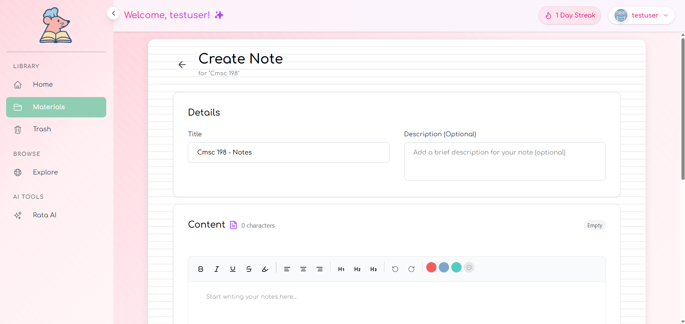
        <br/>
        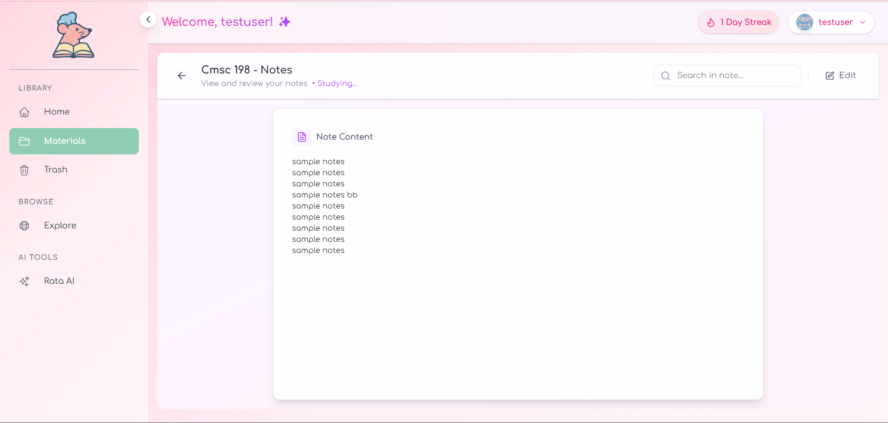
        <br/>
        <em>Upload notes</em>
      </td>
      <td align="center">
        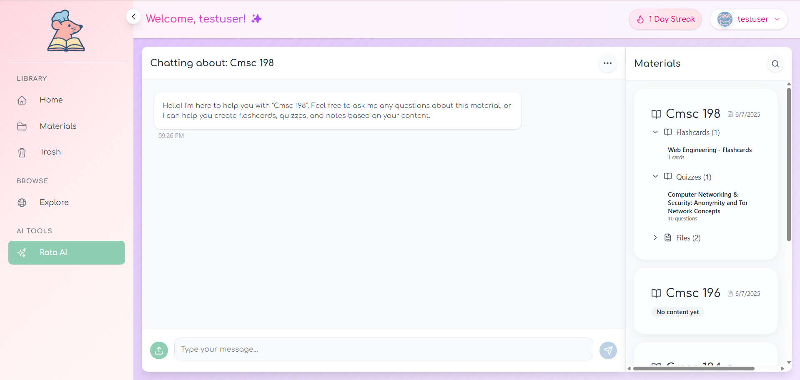
        <br/>
        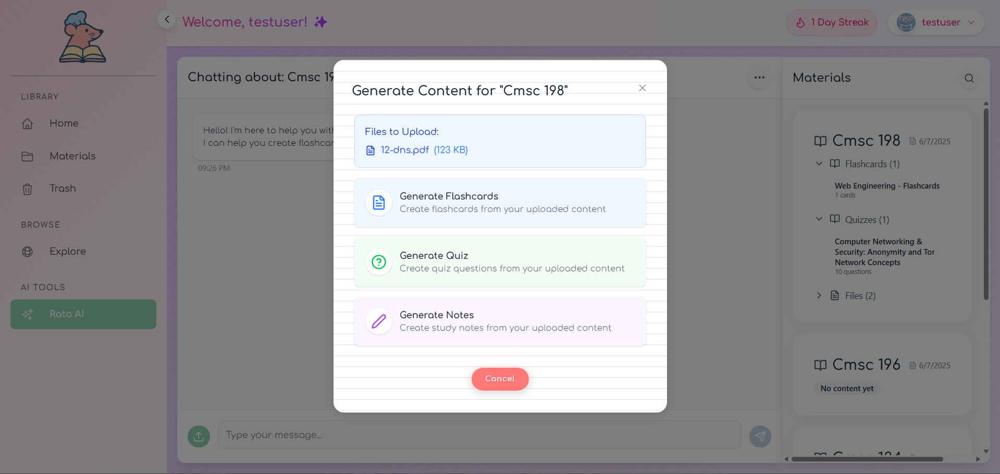
        <br/>
        <em>AI chat</em>
      </td>
    </tr>
    <tr>
      <td align="center">
        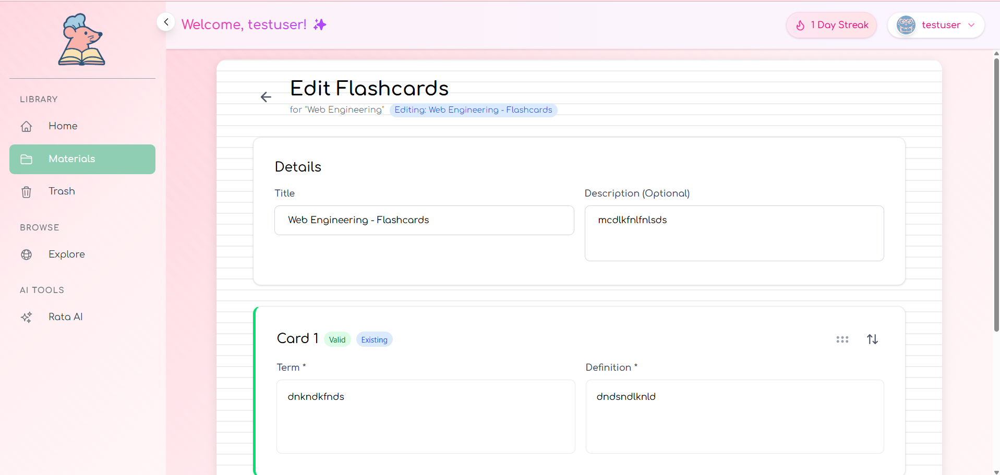
        <br/>
        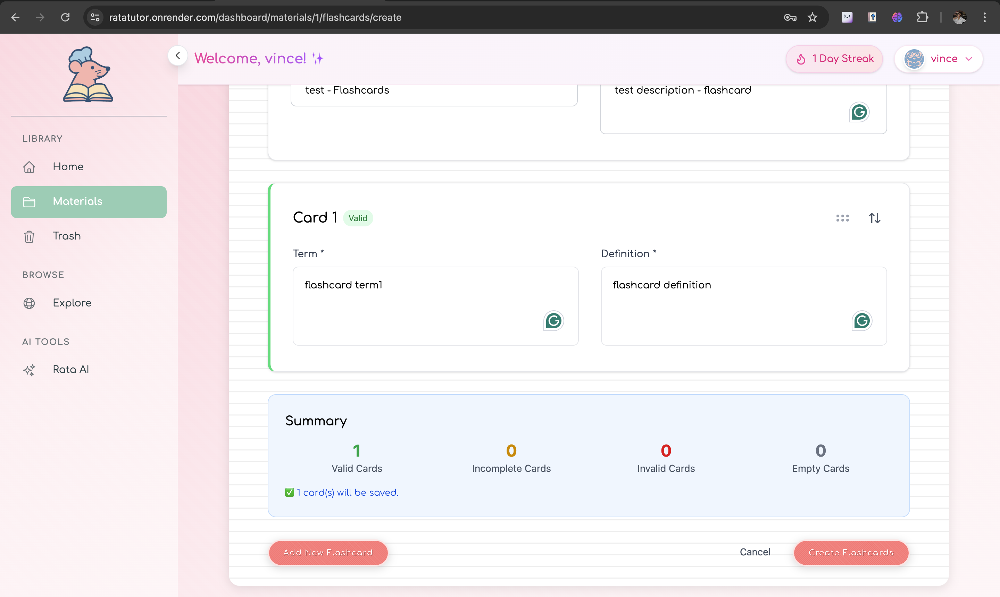
        <br/>
        <em>Flashcards</em>
      </td>
      <td align="center">
        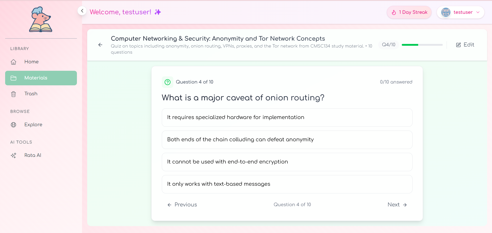
        <br/>
        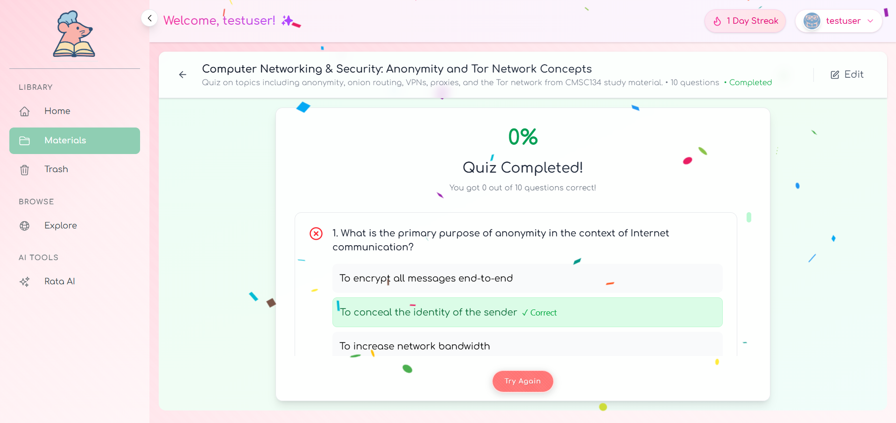
        <br/>
        <em>Quizzes</em>
      </td>
    </tr>
    <tr>
      <td align="center">
        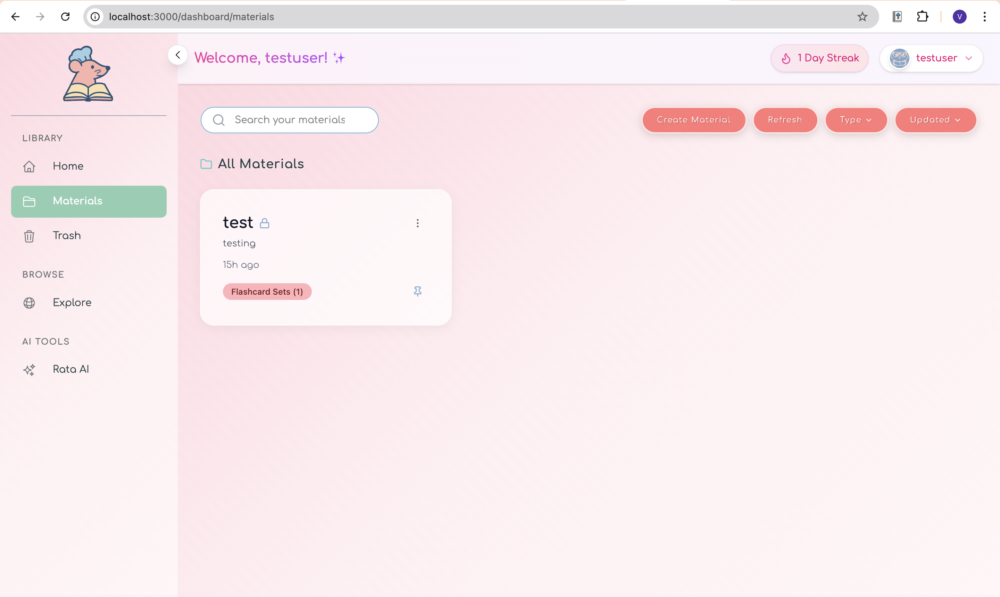
        <br/>
        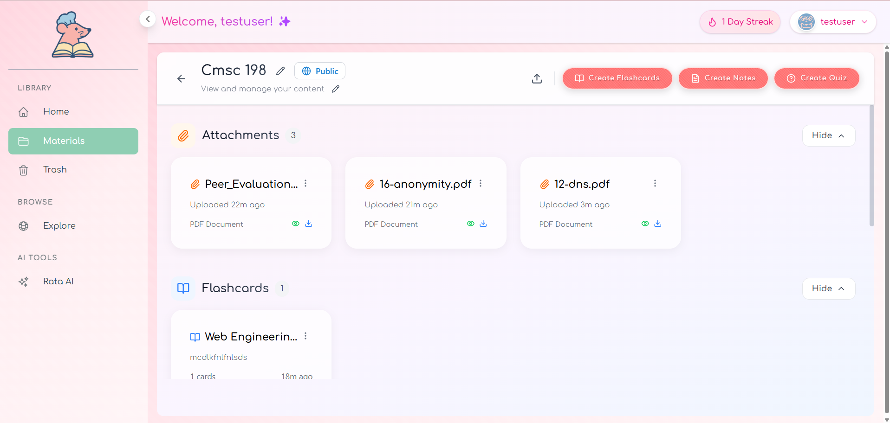
        <br/>
        <em>Material dashboard</em>
      </td>
      <td align="center">
        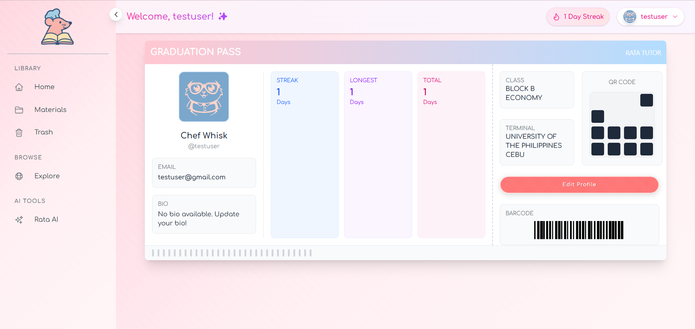
        <br/>
        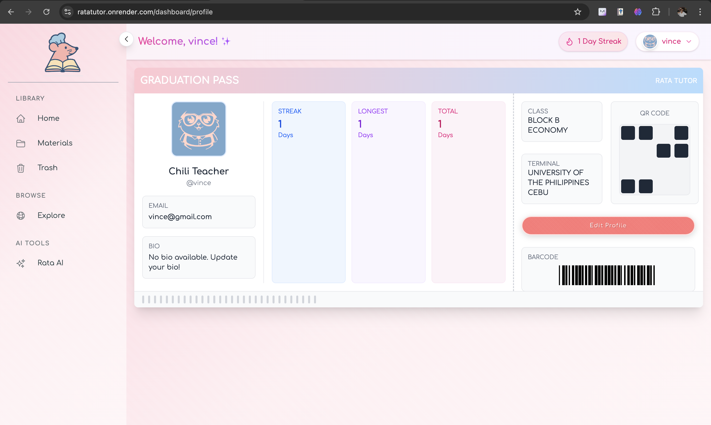
        <br/>
        <em>Profile</em>
      </td>
    </tr>
  </table>
</div>

## Team

RataTutor was created by:

- **Daniel Alexis Cruz** ([@Exalt24](https://github.com/Exalt24))
- **Nikka Joie Mendoza** ([@nikkamendoza](https://github.com/nikkamendoza))
- **Mc Clareenz Zerrudo** ([@clareenz](https://github.com/clareenz))
- **Shaira Joy Macale** ([@howtodoitpleasehelp](https://github.com/howtodoitpleasehelp))
- **Vince Quinañola** ([@binskyut](https://github.com/binskyut))

## License

MIT, see [LICENSE](LICENSE).

<div align="center">
  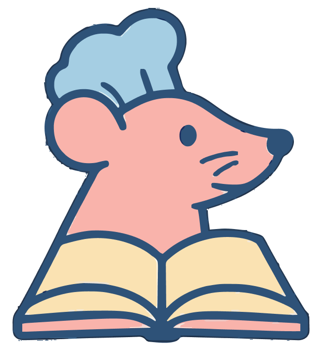
  <p><b>Anyone Can Cook Up Knowledge</b></p>
</div>
