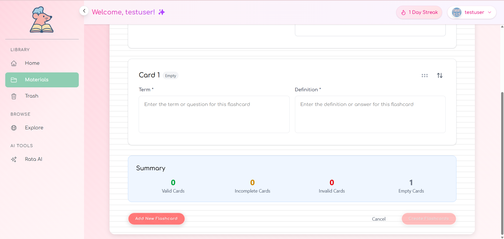
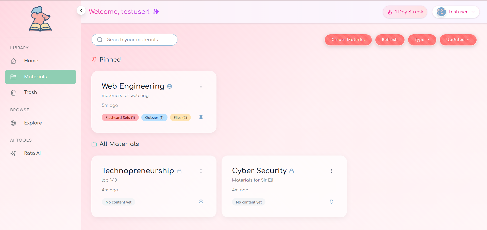
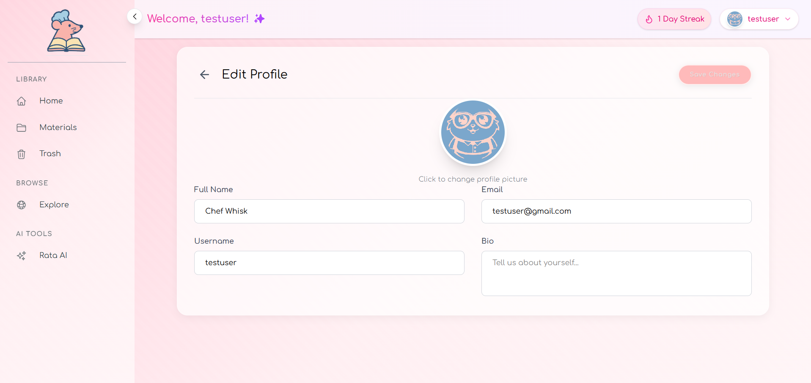

# RataTutor - AI-Powered Study Assistant


A full-stack AI-powered study assistant that converts your notes into flashcards, summaries, and quiz questions. Like a tiny chef guiding your culinary creations, RataTutor helps prepare the perfect recipe for exam success!

## 🚀 Overview

- **Backend:** Django + Django REST Framework + django-cors-headers  
- **Frontend:** React + Vite + Tailwind CSS
- **AI Integration:** OpenRouter API with smart conversation management
- **Development:** Single command (`npm run dev`) to run everything
- **API Proxy:** Frontend `/api/*` requests automatically forwarded to Django
- **Smart Features:** Adaptive AI context, material organization, and content generation

## 📋 Prerequisites

- **Python 3.10+**: For backend development and Django
- **Node.js 20.x**: For frontend development with React
- **Git**: For version control and collaboration
- **OpenRouter API key**: For AI-powered functionality
- **Docker** (optional): For containerized development and deployment

## 🔧 Installation

### 1. Clone the repository

```bash
git clone https://github.com/Exalt24/RataTutor.git
cd RataTutor
```

### 2. Install root dependencies

```bash
npm install
```

### 3. Set up the backend

```bash
cd backend
python -m venv venv

# Activate the virtual environment
# On macOS/Linux:
source venv/bin/activate
# On Windows (PowerShell):
# .\venv\Scripts\Activate.ps1
# On Windows (Command Prompt):
# .\venv\Scripts\activate.bat

# Install Python dependencies
pip install -r requirements.txt

# Create a new .env file for environment variables
# On macOS/Linux:
touch .env

# On Windows (PowerShell):
# New-Item -Path . -Name ".env" -ItemType "File" -Force

# Generate a Django secret key
python -c "from django.core.management.utils import get_random_secret_key; print('SECRET_KEY=' + get_random_secret_key())"

# Add the following variables to your .env file:
# SECRET_KEY=django-insecure-<your-generated-secret>
# DEBUG=True
# EMAIL_HOST_USER=<your-email>
# EMAIL_HOST_PASSWORD=<your-google-api-app-password>  (Note: use app password for Google APIs, not your actual email password)
# OPENROUTER_API_KEY=<your-api-key>
# CLOUDINARY_CLOUD_NAME=<your-cloudinary-cloud-name>
# CLOUDINARY_API_KEY=<your-cloudinary-api-key>
# CLOUDINARY_API_SECRET=<your-cloudinary-api-secret>

# Apply database migrations
python manage.py makemigrations && python manage.py migrate && cd ..
```

**Development Test User:** When running the development environment (`npm run dev`), a test user is automatically created for testing purposes with the following credentials:
- **Username:** `testuser`
- **Email:** `testuser@gmail.com`
- **Password:** `t@st12345`

### 4. Set up the frontend

```bash
cd frontend
npm install

# Create environment files
# On macOS/Linux:
touch .env .env.development .env.production

# On Windows (PowerShell):
# New-Item -Path . -Name ".env" -ItemType "File" -Force
# New-Item -Path . -Name ".env.development" -ItemType "File" -Force
# New-Item -Path . -Name ".env.production" -ItemType "File" -Force

# Add the following configuration to each file:

# For .env (Base variables for all environments):
# VITE_API_URL="http://localhost:8000/api/"
# VITE_APP_TITLE="RataTutor"

# For .env.development (Development-only variables):
# VITE_DEBUG=true

# For .env.production (Production-only variables):
# VITE_DEBUG=false

# Note: Vite automatically selects the right environment file based on build mode.
# Only variables with the VITE_ prefix are exposed to your React code through import.meta.env.

cd ..
```

## 🏃 Development

### Quick Start

Start everything with one command from the project root:

```bash
npm run dev
```

This will:

1. **Create the test user** automatically for development
2. **Start the Django backend server:**
   - Available at [http://localhost:8000](http://localhost:8000)
   - API endpoint at [http://localhost:8000/api/](http://localhost:8000/api/)

3. **Launch the React frontend:**
   - Available at [http://localhost:3000](http://localhost:3000)
   - API calls to `/api/*` are automatically proxied to Django

All server logs appear in the same terminal window for easy monitoring.

### Development Commands

| Command | Description |
|---------|-------------|
| `npm run dev` | Start both backend and frontend servers with test user creation |
| `npm run backend` | Start only the Django backend server |
| `npm run frontend` | Start only the React frontend development server |
| `npm run create-test-user` | Create the test user manually |
| `npm run reset` | **Complete reset:** Delete database and user files, then start fresh |
| `npm run reset:unix` | Reset command for macOS/Linux systems |

### Reset Database and Files

If you encounter issues or want a completely fresh start:

**Windows:**
```bash
npm run reset
```

**macOS/Linux:**
```bash
npm run reset:unix
```

These commands will:
- **Delete SQLite database** (`db.sqlite3`)
- **Remove user-uploaded files** (`media/` and `attachments/` directories)
- **Apply fresh migrations** to create a clean database
- **Start the development servers** automatically

**⚠️ Warning:** The reset command permanently deletes all user data, uploaded files, and database content. Use only in development!

## ✅ Quick Verification Test

Run this quick check whenever you pull changes from `main`:

```bash
# 1. Update all dependencies
npm install
cd backend && pip install -r requirements.txt && cd ..
cd frontend && npm install && cd ..

# 2. Apply database migrations 
cd backend && python manage.py makemigrations && python manage.py migrate && cd ..

# 3. Start the servers
npm run dev

# OR if you encounter database issues
npm run reset
```

Then verify these things work:

1. **Database migrations** completed without errors
2. **Frontend** loads at [http://localhost:3000](http://localhost:3000)
3. **Backend API** is accessible at [http://localhost:8000/api/](http://localhost:8000/api/)
4. **Test user** is automatically created and you can log in with credentials (`testuser` / `t@st12345`)

If any step fails, try running `npm run reset` first, or report an issue if problems persist.

## 🗂️ Project Structure

```
RataTutor/
├─ backend/                   # Django REST API server
│  ├─ accounts/               # User authentication and profile management
│  ├─ api/                    # Core API functionality and endpoints
│  ├─ venv/                   # Python virtual environment (gitignored)
│  ├─ RataTutor/              # Django project settings & configuration
│  ├─ media/                  # User-uploaded files in development (gitignored)
│  ├─ attachments/            # Alternative attachment storage (gitignored)
│  ├─ .env                    # Environment variables (gitignored)
│  ├─ db.sqlite3              # Database file (gitignored)
│  ├─ manage.py               # Django management script
│  └─ requirements.txt        # Python dependencies
│
├─ frontend/                  # React + Vite + Tailwind application
│  ├─ public/                 # Static assets and resources
│  ├─ src/                    # React components and application logic
│  │  ├─ assets/              # Static assets and resources
│  │  ├─ components/          # Reusable UI components
│  │  ├─ pages/               # Page-level components
│  │  ├─ services/            # API integration and services
│  │  ├─ styles/              # Global and Specific CSS styles
│  │  ├─ App.jsx              # Main application component
│  │  ├─ config.js            # Application configuration
│  │  └─ main.jsx             # Application entry point
│  ├─ .env                    # Base environment variables (gitignored)
│  ├─ .env.development        # Development environment variables (gitignored)
│  ├─ .env.production         # Production environment variables (gitignored)
│  ├─ eslint.config.js        # ESLint configuration
│  ├─ index.html              # HTML entry point
│  ├─ package.json            # Frontend dependencies and scripts
│  ├─ package-lock.json       # Frontend dependency lock file
│  └─ vite.config.js          # Vite bundler configuration
│
├─ docker-entrypoint.sh       # Docker container startup script
├─ Dockerfile                 # Docker container definition
├─ package.json               # Root scripts & dependencies
├─ package-lock.json          # Root dependency lock file
├─ LICENSE                    # MIT License file
└─ README.md                  # Project documentation
```

## 🚀 Features

### 📚 Study Material Management
- **Multi-format Upload**: PDF, DOCX, TXT, PPTX support with smart text extraction
- **Intelligent Organization**: Pin materials, trash/restore system, public/private sharing
- **Material Discovery**: Browse and copy public materials from other users
- **Flexible Status Management**: Active, trashed, permanently deleted states
- **Unique Constraints**: Prevents duplicate material titles per user
- **Smart Validation**: Comprehensive permission checking for all operations

### 🤖 AI-Powered Learning Assistant
- **Smart Conversations**: Dedicated AI tutor for each material with persistent chat history
- **Adaptive Context**: AI automatically manages conversation context with intelligent summarization
- **Content Generation**: Create flashcards (1-20), quizzes (1-20), and summary notes
- **Document-Aware Responses**: AI references uploaded content when relevant
- **Topic Detection**: AI recognizes study patterns (flashcards, quizzes, notes) and adjusts responses
- **Conversation Management**: Organized chat history with smart context preservation

### 📊 Advanced Study Tools
- **Interactive Flashcards**: AI-generated question/answer pairs with educational validation
- **Practice Quizzes**: Multiple-choice questions with intelligent distractor generation
- **Smart Summaries**: Key concept extraction with topic-focused formatting
- **Progress Tracking**: Monitor learning progress across all materials
- **Public Sharing**: Share your best study materials with the community

### 🔧 Developer-Friendly Architecture
- **Comprehensive API**: RESTful endpoints for all features with detailed documentation
- **Smart Validation**: Robust permission checking and data validation
- **Flexible Design**: Modular architecture supporting easy feature additions
- **Responsive UI**: Study seamlessly across desktop and mobile devices

## 🧠 AI-Powered Study Features

### Smart Conversation Assistant
- **Material-Specific Chats**: Each study material gets its own dedicated AI tutor
- **Adaptive Context Management**: AI automatically summarizes long conversations to maintain context
- **Intelligent Topic Detection**: AI recognizes when you're studying flashcards, taking quizzes, or reviewing notes
- **Document-Aware Responses**: AI references your uploaded files when answering questions
- **Conversation Persistence**: All chat history is saved and organized by material

### Advanced Material Management
- **Status System**: 
  - Active materials for current study
  - Trash system with restore functionality
  - Permanent deletion option
- **Organization Tools**:
  - Pin important materials to the top
  - Public/private sharing controls
  - Material duplication for different study sessions
- **Smart Discovery**: Browse public materials shared by other users

### Intelligent Content Generation
- **Context-Aware Generation**: AI considers your conversation history when creating content
- **Adaptive Flashcards**: Number of cards based on material complexity (1-20)
- **Dynamic Quizzes**: Multiple-choice questions with intelligent distractor generation (1-20)
- **Smart Summaries**: Key concept extraction with topic-focused formatting

## 🔧 API Endpoints (For Developers)

### Core Resources
```bash
# Materials
GET    /api/materials/              # List user's materials
POST   /api/materials/              # Create new material
GET    /api/materials/pinned/       # Get pinned materials
GET    /api/materials/trash/        # Get trashed materials
GET    /api/materials/public/       # Browse public materials
POST   /api/materials/{id}/copy/    # Copy a material

# AI Conversations  
GET    /api/conversations/                           # List all conversations
GET    /api/materials/{id}/conversation/             # Get/create material conversation
POST   /api/conversations/{id}/chat/                 # Send message to AI
DELETE /api/conversations/{id}/delete/               # Delete conversation
POST   /api/conversations/{id}/regenerate-summary/   # Manually regenerate summary

# Content Generation
POST   /api/materials/{id}/generate-flashcards/     # Generate flashcards
POST   /api/materials/{id}/generate-quiz/           # Generate quiz
POST   /api/materials/{id}/generate-notes/          # Generate summary notes

# File Management
POST   /api/materials/{id}/upload/                  # Upload attachment
DELETE /api/attachments/{id}/                       # Delete attachment

# Notes Management
GET    /api/notes/                                  # List notes
POST   /api/notes/                                  # Create note
GET    /api/notes/{id}/                             # Get specific note
PATCH  /api/notes/{id}/                             # Update note
DELETE /api/notes/{id}/                             # Delete note

# Flashcard Sets
GET    /api/flashcard-sets/                         # List flashcard sets
POST   /api/flashcard-sets/                         # Create flashcard set
GET    /api/flashcard-sets/{id}/                    # Get specific set
PATCH  /api/flashcard-sets/{id}/                    # Update set
DELETE /api/flashcard-sets/{id}/                    # Delete set

# Flashcards
GET    /api/flashcards/                             # List flashcards
POST   /api/flashcards/                             # Create flashcard
GET    /api/flashcards/{id}/                        # Get specific flashcard
PATCH  /api/flashcards/{id}/                        # Update flashcard
DELETE /api/flashcards/{id}/                        # Delete flashcard

# Quizzes
GET    /api/quizzes/                                # List quizzes
POST   /api/quizzes/                                # Create quiz
GET    /api/quizzes/{id}/                           # Get specific quiz
PATCH  /api/quizzes/{id}/                           # Update quiz
DELETE /api/quizzes/{id}/                           # Delete quiz

# Quiz Questions
GET    /api/quiz-questions/                         # List quiz questions
POST   /api/quiz-questions/                         # Create quiz question
GET    /api/quiz-questions/{id}/                    # Get specific question
PATCH  /api/quiz-questions/{id}/                    # Update question
DELETE /api/quiz-questions/{id}/                    # Delete question
```

### Material Actions
```bash
# Material Management
POST   /api/materials/{id}/toggle_pin/              # Pin/unpin material
POST   /api/materials/{id}/toggle_visibility/       # Make public/private
PATCH  /api/materials/{id}/                         # Update (including restore)
DELETE /api/materials/{id}/                         # Soft delete (move to trash)
POST   /api/materials/{id}/permanent_delete/        # Permanent deletion
```

## 🎯 Advanced Usage Examples

### Starting an AI Study Session
```javascript
// Get or create a conversation for a material
const conversation = await startMaterialConversation(materialId);

// Send a message and get AI response
const response = await sendMessage(conversation.id, "Explain photosynthesis");

// Access smart context information
console.log(response.topic);                // Current conversation topic
console.log(response.messagesSinceSummary); // Messages since last summary
console.log(response.summaryPreview);       // Preview of conversation summary
```

### Managing Study Materials
```javascript
// Create a material and upload files
const material = await createMaterial({
  title: "Biology Chapter 3",
  description: "Photosynthesis and cellular respiration"
});

// Upload study document
await uploadAttachment(material.id, file);

// Generate study content
await generateFlashcards(material.id, 10);  // Generate 10 flashcards
await generateQuiz(material.id, 5);         // Generate 5 quiz questions
await generateNotes(material.id);           // Generate summary notes

// Organize materials
await toggleMaterialPin(material.id);       // Pin/unpin material
await toggleMaterialVisibility(material.id); // Make public/private
```

### Working with Generated Content
```javascript
// Get all content for a material
const material = await getMaterial(materialId);
console.log(material.flashcard_sets);      // All flashcard sets
console.log(material.quizzes);             // All quizzes
console.log(material.notes);               // All notes

// Create custom flashcard set
const flashcardSet = await createFlashcardSet({
  material: materialId,
  title: "Key Terms",
  description: "Important vocabulary",
  flashcards: [
    { question: "What is photosynthesis?", answer: "The process by which plants convert light energy into chemical energy" },
    { question: "What is chlorophyll?", answer: "The green pigment that captures light energy in plants" }
  ]
});
```

## 🔍 Smart Features in Detail

### Adaptive AI Context
The AI conversation system includes sophisticated context management:
- **Automatic Summarization**: Long conversations are automatically summarized to maintain context without overwhelming the AI
- **Threshold Management**: Summary frequency adapts based on conversation complexity (5-8 messages depending on topic complexity)
- **Topic Detection**: AI recognizes study patterns and adjusts responses accordingly
- **Material Integration**: AI knows when to reference uploaded documents vs. general knowledge
- **Conversation Memory**: Smart context preservation across sessions

### Material Organization Intelligence
- **Unique Constraints**: Prevents duplicate material titles per user with automatic numbering
- **Smart Validation**: Comprehensive permission checking for all operations
- **Flexible Status Management**: Materials can be active, trashed, or permanently deleted
- **Public Discovery**: Users can browse and copy public materials from others
- **Hierarchical Organization**: Materials contain notes, flashcard sets, quizzes, and conversations

### Content Generation Intelligence
- **Smart Defaults**: Generation parameters adapt to content complexity
- **Context Awareness**: AI considers previous conversations and material content
- **Format Optimization**: Generated content follows educational best practices
- **Validation**: All generated content is validated for educational quality
- **Incremental Building**: Generate content iteratively based on study progress

## 🛠️ Troubleshooting

### Common Issues

**Database connection errors:**
```bash
npm run reset
```

**Permission errors on file uploads:**
- Check that `backend/media/` and `backend/attachments/` directories are writable
- On Unix systems: `chmod 755 backend/media backend/attachments`

**AI conversation errors:**
- Verify `OPENROUTER_API_KEY` is set correctly in backend `.env`
- Check API key permissions on OpenRouter dashboard
- Monitor API usage limits

**Port conflicts:**
- Backend (Django): Change port in `npm run backend` if 8000 is busy
- Frontend (React): Change port in `npm run frontend` if 3000 is busy

**Missing dependencies:**
```bash
# Reinstall all dependencies
npm install
cd backend && pip install -r requirements.txt && cd ..
cd frontend && npm install && cd ..
```

**Conversation context issues:**
```bash
# Reset conversation summaries (via Django shell)
cd backend
python manage.py shell
>>> from api.models import AIConversation
>>> AIConversation.objects.update(summary_context="", messages_since_summary=0)
```

### Clean Installation

For a completely fresh setup:

```bash
# Remove all generated files
npm run reset

# Reinstall dependencies
npm install
cd backend && pip install -r requirements.txt && cd ..
cd frontend && npm install && cd ..

# Start fresh
npm run dev
```

## 🖼️ Screenshots & Showcase

<div align="center">
  <p><i>Screenshots and GIFs of RataTutor in action.</i></p>
  <!-- Placeholder for future screenshots -->
  <table>
    <tr>
      <td align="center">
        
        <br/>
        
        <br/>
        
        <br/>
        
        <br/>
        <em>Upload Notes</em>
      </td>
      <td align="center">
        
        <br/>
        
        <br/>
        <em>AI Chat Assistant</em>
      </td>
    </tr>
    <tr>
      <td align="center">
        
        <br/>
        
        <br/>
        
        <br/>
        
        <br/>
        
        <br/>
        <em>Flashcards Generation</em>
      </td>
      <td align="center">
        
        <br/>
        
        <br/>
        
        <br/>
        
        <br/>
        
        <br/>
        
        <br/>
        <em>Interactive Quizzes</em>
      </td>
    </tr>
    <tr>
      <td align="center">
        
        <br/>
        <em>Material Dashboard</em>
      </td>
      <td align="center">
        
        <br/>
        
        <br/>
        <em>Profile Tab</em>
      </td>
    </tr>
  </table>
</div>

## 🤝 Contributing

1. **Create a branch** from `main` with a descriptive name
2. **Make focused commits** that address specific issues
3. **Push your branch** and open a Pull Request against `main`
4. **Run the verification test** before requesting a code review

### Development Guidelines

- Follow Django and React best practices
- Ensure all API endpoints have proper validation
- Add tests for new AI conversation features
- Update documentation for new endpoints
- Test AI generation with various content types

## 🐳 Local Docker Test

1. **Build the image**

   ```bash
   docker build -t ratatutor .
   ```
2. **Run the container**

   ```bash
   docker run --rm -it \
     -p 8000:8000 \
     -e SECRET_KEY="<your-secret>" \
     -e DEBUG=True \
     -e DATABASE_URL="sqlite:///db.sqlite3" \
     -e OPENROUTER_API_KEY="<your-openrouter-api-key>" \
     -e CLOUDINARY_CLOUD_NAME="<your-cloudinary-cloud-name>" \
     -e CLOUDINARY_API_KEY="<your-cloudinary-api-key>" \
     -e CLOUDINARY_API_SECRET="<your-cloudinary-api-secret>" \
     ratatutor
   ```
3. **Verify**

   * SPA: [http://localhost:8000/](http://localhost:8000/) → your React app
   * API: [http://localhost:8000/api/](http://localhost:8000/api/) → Django REST API

## 🚀 Deployment on Render

Render will build your Docker image and deploy one service for both backend and frontend.

1. **Push** your code and Docker files:

   ```bash
   git add Dockerfile docker-entrypoint.sh
   git commit -m "Add Docker deploy config"
   git push origin main
   ```
2. In Render dashboard → **New → Web Service**

   * **Environment:** Docker
   * **Root Directory:** *leave blank* (Dockerfile in repo root)
   * **Env Vars:** set `SECRET_KEY`, `DEBUG`, `EMAIL_HOST_USER`, `EMAIL_HOST_PASSWORD`, `OPENROUTER_API_KEY`, `CLOUDINARY_CLOUD_NAME`, `CLOUDINARY_API_KEY`, `CLOUDINARY_API_SECRET`
3. **Create** and let Render build/deploy

Your service URL:

```
https://<your-service-name>.onrender.com/
```

* API: `/api/`
* SPA: `/`

**Demo Site:** To see a working example, visit [https://ratatutor.onrender.com](https://ratatutor.onrender.com)

## 👨‍👩‍👧‍👦 Team & Acknowledgements

RataTutor was created by:

- **Daniel Alexis Cruz** ([@Exalt24](https://github.com/Exalt24))
- **Nikka Joie Mendoza** ([@nikkamendoza](https://github.com/nikkamendoza))
- **Mc Clareenz Zerrudo** ([@clareenz](https://github.com/clareenz))
- **Shaira Joy Macale** ([@howtodoitpleasehelp](https://github.com/howtodoitpleasehelp))
- **Vince Quinañola** ([@binskyut](https://github.com/binskyut))

Special thanks to all contributors and supporters who helped make this project possible.

## 📚 Resources & Documentation

* [Django REST Framework Documentation](https://www.django-rest-framework.org/)
* [Vite + React Guide](https://vitejs.dev/guide/)
* [Tailwind CSS Documentation](https://tailwindcss.com/docs/)
* [OpenRouter API Documentation](https://openrouter.ai/docs)

## 📄 License

This project is licensed under the MIT License - see the [LICENSE](LICENSE) file for details.

---

<div align="center">
  
  <p>
    <b>Anyone Can Cook Up Knowledge</b><br/>
    Crafted with ❤️ by the RataTutor Team © 2025
  </p>
</div>